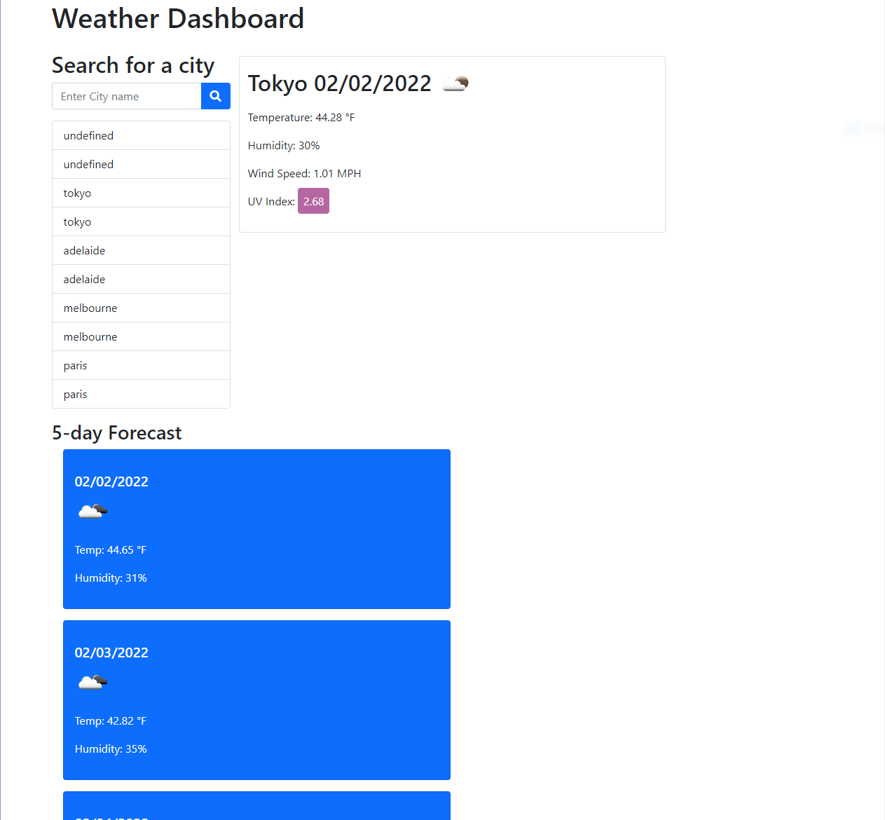

# Assignment 6 - Weather app
The goal of this project is to create a single page application that will accept a user supplied location and find the weather data for that location.
The app needs to have a text submit field
the app needs to have a history of recent searches
the app needs to have an icon for the conditions, wind speed, humidity, UV index and most importantly the temperature
The UV index should be colored with respect to the value (mild, moderate, extreme)
There needs to be a displayed five day forecast for the selected city
When a city is clicked from the search history, the weather should be shown for it

I  was not  able to get the CSS to a satisfactory layout and style

github link [github](https://github.com/PastaShock/Weather-dashboard)
pages link [githubpages](https://pastashock.github.io/Weather-dashboard/)